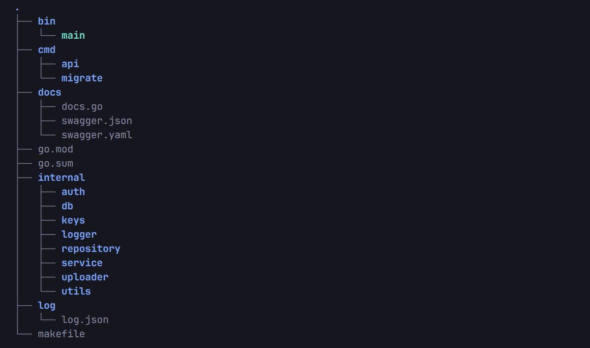

## Falcon


Falcon is a CLI tool for generating Go REST APIs. 
The generated project already includes authentication, 
Swagger documentation, the Zap logger, and follows the Handler–Service–Repository pattern.

## Features

- Create New Project.
- Options to choose router and Database (Currently only Chi Router and Mysql Database is available).


## Prerequisite

- [Go v1.24.3](https://go.dev/doc/install) 
- [Migrate](https://github.com/golang-migrate/migrate) 
- [Swag](https://github.com/swaggo/swag) 
- [Air](https://github.com/air-verse/air)


## Installation

Falcon requires [Go](https://go.dev/doc/install) v1.24+ to run.

Download it in:
- [Binaries](https://github.com/faizisyellow/falcon/releases) are available for Linux, macOS, and Windows.

    ```
    // linux
    tar -xvzf  falcon_Linux_x86_64.tar.gz 
    sudo mv falcon /usr/local/bin/
    ```

## Overview Project Structure



> **cmd/api** directory is where your REST APIs application's live.
>
> **cmd/migrate/migrations** directory is where you create sql quearies.
>
> **docs** directory is the swagger docs generated.
>
> **internal** directory is where all application local packages  live.
>
> **log/log.json** file to log error level to fatal level.
>
> **makefile** file to command migration, generate swagger doc, etc..


## Usage

Let's get started shall we?

1. Create Go Module in your project root directory.
2. Create new project.

   ```
   falcon init 
   ```
   
3. Run :
    
    ```
    Go mod tidy 
    ```

4. Rename **.env.sample** to **.env** and fill in the environment variable.
5. Run migration :

    ```
    make migrate-up
    ```
    
    make sure you already create a database.
    
6. Run swag doc generator :
    
    ```
    make gen-docs
    ``` 

7. Run air to started the server :

    ```
    air
    ```
    
   Your swagger documentation now in <http://localhost:8080/v1/swagger/index.html>

See more commands in 
```
Falcon --help
```  
